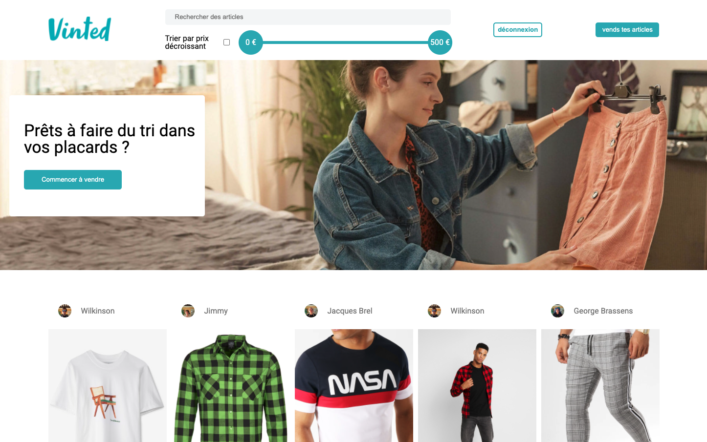
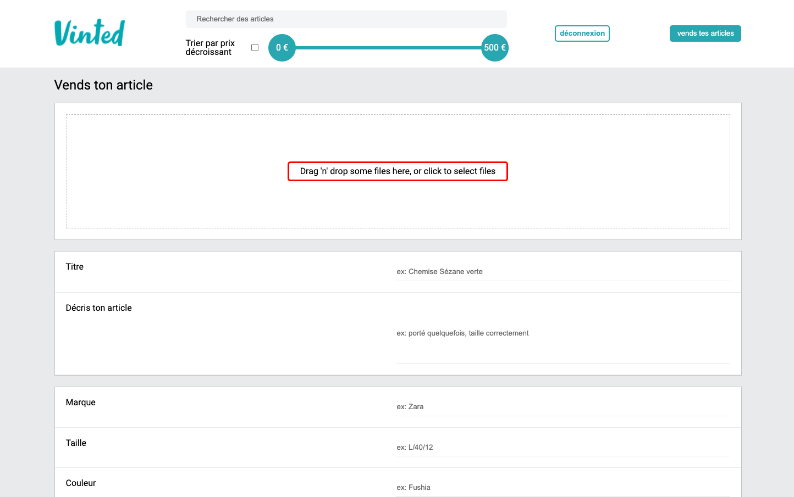

# Vinted copy

This project is a copy of the Vinted web app's frontend.

## What can you do with this app ?

### Home page

On the home page, you have all the products available. You can decide to have them ordered by increasing or decreasing price. You can also decide to search between the products based on :

- Their name
- A price range

If you click on one of the offers displayed, you will be redirected to the offer page.

You also have a login `se connecter` and a signup `s'inscrire` button. They redirect you to the login and the signup pages. The button `vends tes articles` redirects you to the login page or to the publish page if you are connected.

### Signup page

This page let's you signup and request a username, email and password.

The signup page let's you acces to the login page by clicking on the `Tu as déjà un compte ? Connecte-toi !` button.

### Login page

The login page is eather a modal (if you get hear by clicking on the `se connecter`) or a normal page if you click on the `vends tes articles` (sell your articles) button.

It needs you email and your password to let you in.

The login page let's you acces to the signup page by clicking on the `Pas encore de compte ? inscris-toi ?` button.

### Offer page

On this page you get all the informations about the product. You can decide to "buy" it by clicking on the `acheter` button. By doing so you get redirected to the login page if you are not connected ; if you are, it will lead you to the payment page.

### Payment page

This page let's you check the price of the object and the fees. It let's you enter your card number and pay by clicking on the `pay` button.

### Publish page

The publish page let's you publish a product and sell it. You need to enter some informations on it, you can and pictures and decide the price.

Publish you offer by clicking on `ajouter`.

---

This project was bootstrapped with [Create React App](https://github.com/facebook/create-react-app).

## Available Scripts

In the project directory, you can run:

### `yarn`

To install the dependencies

### `yarn start`

Runs the app in the development mode. 
Open [http://localhost:3000](http://localhost:3000) to view it in the browser.

The page will reload if you make edits. 
You will also see any lint errors in the console.

### `yarn test`

Launches the test runner in the interactive watch mode. 
See the section about [running tests](https://facebook.github.io/create-react-app/docs/running-tests) for more information.

### `yarn build`

Builds the app for production to the `build` folder. 
It correctly bundles React in production mode and optimizes the build for the best performance.

The build is minified and the filenames include the hashes. 
Your app is ready to be deployed!

See the section about [deployment](https://facebook.github.io/create-react-app/docs/deployment) for more information.

### `yarn eject`

**Note: this is a one-way operation. Once you `eject`, you can’t go back!**

If you aren’t satisfied with the build tool and configuration choices, you can `eject` at any time. This command will remove the single build dependency from your project.

Instead, it will copy all the configuration files and the transitive dependencies (webpack, Babel, ESLint, etc) right into your project so you have full control over them. All of the commands except `eject` will still work, but they will point to the copied scripts so you can tweak them. At this point you’re on your own.

You don’t have to ever use `eject`. The curated feature set is suitable for small and middle deployments, and you shouldn’t feel obligated to use this feature. However we understand that this tool wouldn’t be useful if you couldn’t customize it when you are ready for it.

## Learn More

You can learn more in the [Create React App documentation](https://facebook.github.io/create-react-app/docs/getting-started).

To learn React, check out the [React documentation](https://reactjs.org/).

### Code Splitting

This section has moved here: https://facebook.github.io/create-react-app/docs/code-splitting

### Analyzing the Bundle Size

This section has moved here: https://facebook.github.io/create-react-app/docs/analyzing-the-bundle-size

### Making a Progressive Web App

This section has moved here: https://facebook.github.io/create-react-app/docs/making-a-progressive-web-app

### Advanced Configuration

This section has moved here: https://facebook.github.io/create-react-app/docs/advanced-configuration

### Deployment

This section has moved here: https://facebook.github.io/create-react-app/docs/deployment

### `yarn build` fails to minify

This section has moved here: https://facebook.github.io/create-react-app/docs/troubleshooting#npm-run-build-fails-to-minify
